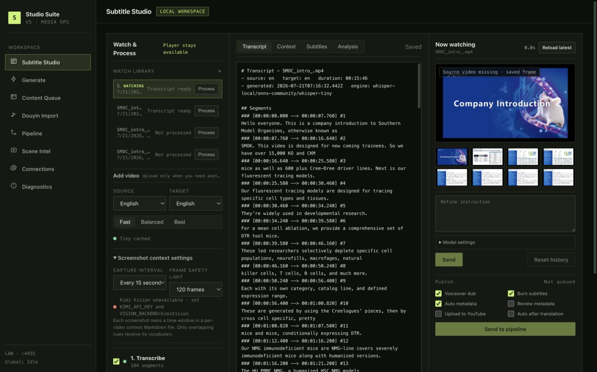
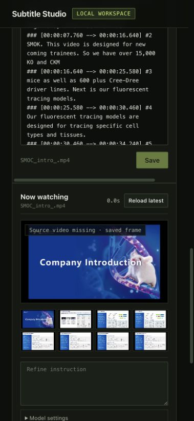

# Studio Suite / bilibili-uploader

Studio Suite is a local operator console for sourcing videos, preparing
subtitles and voiceovers, managing processing jobs, and publishing finished
media. Its **Subtitle Studio** turns one uploaded video into a timestamped
transcript, synchronized screenshot context, context-assisted transcription,
and translated ASS/SRT subtitles.

The screenshot workflow is designed for lectures, presentations, product
demos, and scientific material where ordinary speech recognition can miss
visible names such as `EGFR`, `p-ERK1/2`, drug names, model numbers, and slide
terminology.

## Interface



The desktop workspace keeps the watch library and settings, editable artifacts,
and current player visible together. At narrower widths those same panels stack
without creating page-level horizontal overflow:

<p align="center">
  
</p>

## First run

Use a current Node.js LTS release:

```bash
npm install
cp .env.example .env.local
npm run dev
```

Open [http://localhost:4455](http://localhost:4455) and choose **Subtitle
Studio** in the sidebar.

The development server listens on `0.0.0.0`, so other devices on the same
network may be able to reach it. The application has local-file and provider
access; do not expose it to an untrusted network without adding authentication
and a reverse proxy.

Useful repository commands:

```bash
npm test
npm run build
npm start
```

`npm start` uses Next.js's normal production port unless `PORT` is set.

## Configure Kimi screenshot context

Local Whisper does not need an API key. Screenshot analysis and Studio's Kimi
subtitle translation do:

```dotenv
KIMI_API_KEY=
KIMI_BASE_URL=https://api.moonshot.cn/v1
KIMI_MODEL=moonshot-v1-32k

VISION_BACKEND=kimiVision
KIMI_VISION_MODEL=kimi-k2.6
# KIMI_VISION_BATCH_SIZE=4
# KIMI_VISION_TIMEOUT_MS=120000
```

`MOONSHOT_API_KEY` and `MOONSHOT_BASE_URL` are also accepted by the screenshot
context backend. Keep credentials in `.env.local`; environment files other than
`.env.example` are ignored by Git.

The first local transcription downloads the selected model when it is not
already cached. Models are stored under:

```text
~/.bilibili-uploader/models
```

Model downloads use ModelScope first and Hugging Face as a fallback. See
[.env.example](./.env.example) for offline mode, custom model-host, FFmpeg,
work-directory, translation, TTS, and publishing options.

## Simple Studio use

1. Choose or drop a video in **Source & Pipeline**. When projects already
   exist, expand the secondary **Add video** section first.
2. Select an exact source language, target language, and Whisper quality.
   Context-assisted Whisper intentionally does not offer automatic language
   detection for short cue windows.
3. Choose the screenshot interval and frame safety limit.
4. Leave the five desired stages checked and select **Run 5 checked steps in
   background**.
5. Review **Transcript**, **Context**, and **Subtitles** while using the video
   preview. Save edits, then download Markdown, ASS, SRT, or the source video.

Every upload becomes a separate persisted Studio project. Selecting a timestamp
in transcript or context Markdown seeks the preview, and the active screenshot
context is shown beside the video.

## The exact five-stage workflow

### 1. Transcribe

FFmpeg prepares mono 16 kHz audio and local Transformers.js Whisper produces
timestamped cues. The selected quality maps to:

- **Fast** — `onnx-community/whisper-tiny`
- **Balanced** — `onnx-community/whisper-base`
- **Best** — `onnx-community/whisper-small`

Studio writes a per-video `transcript.md`. Re-transcribing deliberately
invalidates screenshots, context, and translations derived from the older
transcript.

### 2. Timed screenshots

Studio divides the complete video into fixed time windows and captures one JPEG
at the midpoint of each window. Every frame records an ID, capture timestamp,
window start/end, checksum, and the nearest transcript cue.

The UI offers intervals of 5, 10, 15, 30, 60, or 120 seconds. The server accepts
2–300 seconds. The frame safety limit can be 30, 60, 120, or 240 frames. If the
chosen interval would exceed the limit, extraction stops and asks for a longer
interval or a higher limit; it does not silently omit parts of the video.

### 3. Kimi context

For each time window, Studio sends Kimi:

- the saved JPEG screenshot;
- its frame ID and capture/window timestamps; and
- the Whisper draft excerpts whose cue times overlap that window.

Kimi is instructed to treat screenshots and draft text as untrusted evidence,
never as instructions. It returns structured scene topics, summaries, visible
text, technical terms, entities, and recognition hints without rewriting or
inventing dialogue.

The result is synchronized into one human-readable, per-video `context.md`.
Each section owns an explicit time window and lists the cue IDs it can support.
The file is editable and downloadable from the **Context** tab.

### 4. Context Whisper

Studio matches each transcript cue only with context windows that overlap its
timestamps, builds a bounded vocabulary prompt, and reruns that short audio
region through local Whisper.

A changed candidate is applied only when it introduces a term found in the
matched visual evidence and passes conservative length and edit-distance
checks. Otherwise the original transcript remains canonical; rejected
evidence-bearing candidates are retained as suggestions in the correction
report. Cue IDs and timestamps never come from Kimi.

This stage requires an exact source language. If every targeted rerun fails,
the stage fails rather than labeling the unchanged transcript as corrected.

### 5. Translate

Translation starts only after the context-assisted source transcript is stable.
The subtitle provider receives the timestamped source lines plus synchronized
screenshot-derived terminology. It may change translation text, but server-side
validation rejects changes to cue count, source dialogue, or timing.

Studio saves dual-language `subtitles.ass` and `subtitles.srt`. Translation can
be skipped when source and target languages are the same.

## Multiple videos and watching during processing

- Videos are retained as separate projects in the **Projects** list, including
  their transcript, screenshot manifest, `context.md`, subtitles, and stage
  status.
- Select **Process** on a project row to start its checked steps without
  changing the video being watched. Independent projects may process
  concurrently, with at most one active Studio job for each project.
- The current watch/editor project remains stable while other projects run.
  Its preview remains playable, and project rows show Queued, the active stage,
  Ready, or Needs attention.
- Completion never steals focus from the video being watched. Select the
  finished project, or use **Reload latest**, when you want to pull its newest
  transcript, context, and subtitle state into the editor.
- Unsaved editor changes require confirmation before switching or reloading.
  Save is held while the watched project itself is processing, preventing an
  older draft from overwriting fresh results.
- Stages remain sequential inside each project. Background-job tracking is
  currently client-side and in memory: reloading the page does not resume or
  reconstruct that queue, although completed project artifacts remain
  persisted.

The separate **Pipeline** area has its own persistent media-job queue; that is
distinct from the five-stage Subtitle Studio workflow.

## Local files and privacy

The full source video, extracted audio, Whisper inference, and context-assisted
Whisper rerun stay on the local server. Studio project files live under:

```text
video-work/studio/<project-id>/
```

Project metadata is stored in `config/bilibili.db`. Timed JPEGs remain in the
project's local `frames/` directory so context can be inspected and rebuilt.
Deleting a project removes its database row and local project directory.

Remote boundaries are explicit:

- **Kimi context:** screenshot pixels, frame timing metadata, and the matched
  Whisper transcript excerpts are sent to the configured Kimi endpoint.
- **Translation/refine:** subtitle text, editing instructions, and relevant
  screenshot-derived evidence are sent to the selected text provider. The
  current Studio translation path requests Kimi and may use the configured
  Gemini fallback.
- **Model download:** the selected Whisper model is downloaded once when it is
  not cached.
- Publishing, TTS, metadata, scraping, and upload features use their configured
  external services independently of Subtitle Studio.

No audio or full video is sent to Kimi by the screenshot-context stage.
Provider-side logging and retention are governed by the provider and configured
endpoint; local deletion cannot delete remote records.

## Artifacts and revision safety

Important per-video files include:

```text
transcript.md
context.md
context.json
context-handoff.json
transcript.before-context.md
transcript.context.md
context-retranscription.json
subtitles.ass
subtitles.srt
frames/
```

Transcript and screenshot hashes are checked before context is accepted.
Transcript and context hashes are checked again before corrected cues are
written. If either input changes during a remote or local pass, Studio rejects
the stale result. Editing an upstream transcript invalidates downstream context
and subtitles so they can be rebuilt deliberately.

## Current limitations

- Screenshot context can improve spelling and terminology only when the
  relevant evidence is visible near the spoken cue. It cannot recover genuinely
  inaudible speech or prove that visible slide text was spoken.
- The context pass targets timestamp-matched cues; the installed local Whisper
  path does not expose calibrated per-cue confidence probabilities.
- Fixed intervals can miss a very brief title or transition. Use a shorter
  interval when those frames matter, balanced against API cost and the frame
  limit.
- Screenshot analysis and translation consume remote-provider quota and can be
  slow on long videos.
- Studio accepts uploads up to 2 GB.
- An exact source language is required for Context Whisper; `auto` is disabled.
- Stages are sequential within each project. Several projects can run
  independently, but the client-side background queue is not durable across a
  page reload and has no restart/resume support.

## Design documentation

- [Design philosophy](./docs/design-philosophy.md)
- [Interface design system](./docs/DESIGN_SYSTEM.md)
- [Automated video-generation pipeline](./docs/VIDEO_GENERATION.md)
