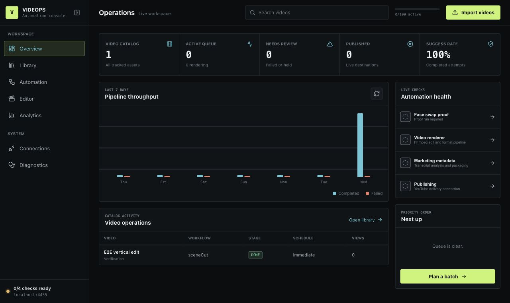
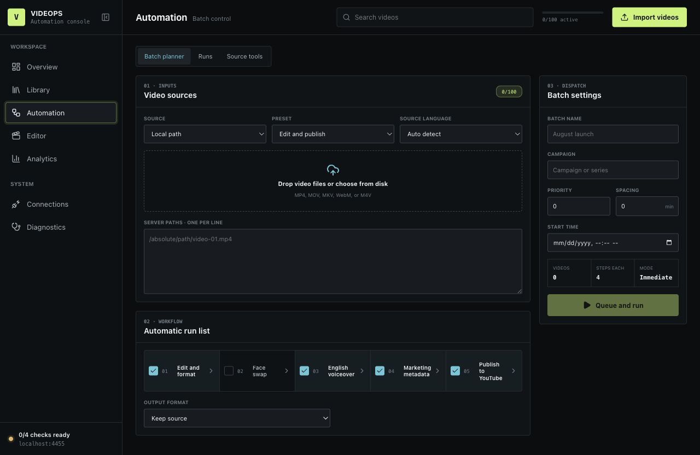

# VIDEOPS — video automation console

`bilibili-uploader` is a self-hosted operator console for a video pipeline:
import a video from a local file, Bilibili, or Douyin; run it through an
ordered chain of processors (scene cutting, face swap, AI voiceover, AI
metadata); publish it to YouTube; and track what happened afterwards. A second,
interactive workflow — **Subtitle Studio** — turns one video into a timestamped
transcript, synchronized screenshots, screenshot-assisted transcription, and
translated ASS/SRT subtitles.

Everything runs on your own machine against a local SQLite database. Remote AI
providers are used only where a stage explicitly calls them, and every one of
those boundaries is listed under [Privacy and remote boundaries](#privacy-and-remote-boundaries).



## Contents

- [What it does](#what-it-does)
- [Requirements](#requirements)
- [Quick start](#quick-start)
- [How to use the console](#how-to-use-the-console)
- [Batch automation](#batch-automation)
- [Subtitle Studio](#subtitle-studio)
- [Configuration](#configuration)
- [Runtime topology](#runtime-topology)
- [Where files live](#where-files-live)
- [Privacy and remote boundaries](#privacy-and-remote-boundaries)
- [Development](#development)
- [Limitations](#limitations)
- [Documentation](#documentation)

## What it does

| Area | Capability |
|---|---|
| Sources | Local file upload or server path, Bilibili video/space URLs, Douyin video, profile, mix, or music pages (via a FastAPI sidecar) |
| Processors | `sceneCut` (ffmpeg cut/concat/reformat), `faceFusion` (targeted face swap), `voiceover` (Whisper → translate → Kimi re-script → TTS → duck & overlay), `metadata` (AI title/description/tags), `aiEditor` (LAN Hugging Face endpoint) |
| Uploaders | YouTube, via the Data API or a guided desktop uploader; per-job OAuth identity chosen from registered authorizations |
| Batching | Presets, priority, scheduled start, spacing between uploads, and a durable job queue processed by a background worker |
| Editing | Subtitle Studio, a clip cutter, and a scene library |
| Tracking | Video catalog with search and bulk actions, per-publication analytics snapshots, API quota metering, and a diagnostics panel |

## Requirements

- **Node.js** — a current LTS release.
- **Python 3.10+** — for YouTube publishing and the helper scripts in
  `scripts/python/`. Install with `pip install -r requirements.txt`.
- **FFmpeg** — the pipeline uses the bundled `ffmpeg-static` and
  `@ffprobe-installer/ffprobe` binaries, so no install is strictly required;
  diagnostics additionally checks for `ffmpeg` on your `PATH`. Set
  `FFMPEG_PATH` / `FFPROBE_PATH` to point at your own build.
- **Disk** — the diagnostics panel warns below 5 GB free in the work directory.
- Optional, per feature: a FaceFusion checkout (`scripts/install_facefusion.sh`),
  a Douyin downloader sidecar, a CosyVoice or Qwen3-TTS server, and API keys for
  Kimi/Moonshot, OpenAI, Gemini, ElevenLabs, or DashScope.

## Quick start

```bash
npm install
cp .env.example .env.local
npm run dev
```

Open <http://localhost:4455>.

`npm run dev` starts two processes: the **web control plane** (Next.js) and the
**pipeline worker** that drains the job queue. Set `PORT` to change the port.
For production, build first:

```bash
npm run build
npm start
```

> **Security.** Both commands bind `0.0.0.0`, so anything on your network can
> reach the console, and the console has local-file access, stored provider
> credentials, and publishing rights. There is no built-in login. Keep it on a
> trusted network, or put authentication and a reverse proxy in front of it.

## How to use the console

The sidebar has five workspace views and two system views.

### Overview

Live counts for the catalog, active queue, items needing review, published
videos, and success rate; a seven-day completed-vs-failed throughput chart;
automation health checks; recent catalog activity; and the next queued items.
Use it as the landing page — the health panel links straight to whatever is
not ready yet.

### Library

The full video catalog backed by SQLite, paginated at 50 rows. Search by title,
filter by stage (`draft` through `published`, `failed`, `canceled`), edit a
video's catalog record, open its publication on the destination platform, and
select rows for bulk retry or cancel.

### Automation



Four tabs:

- **Batch planner** — the main entry point. Pick a source, a preset, and a
  source language; drop files or paste one absolute server path per line;
  check the steps to run; name the batch, set priority, spacing, and an
  optional start time; then **Queue and run**.
- **Runs** — the pipeline dashboard: live job and step status, logs, retry,
  and cancel.
- **Proof** — runs a face swap on a short clip so you can verify the
  FaceFusion setup before committing a batch to it.
- **Source tools** — single-video generation, and the Douyin importer.

### Editor

- **Subtitle studio** — the five-stage transcription workflow described below.
- **Cut and format** — import a video, define clip ranges and an aspect ratio,
  and queue a `sceneCut` job.
- **Scene library** — saved scenes for reuse.

### Analytics

Views, watch time, engagement rate, click-through rate, and conversions per
published video. Metrics are dated snapshots recorded per publication — entered
in the UI or posted to `/api/operations/analytics` — so the trend line reflects
the snapshots you have recorded. Nothing is pulled from platform APIs
automatically yet.

### Connections

Two halves. **Runtime connection** chooses where the database and worker live
(see [Runtime topology](#runtime-topology)). **Service connections** is the
credential checklist for every source, processor, and uploader: fill the fields
an adapter needs, test the connection, and enable it. Registered
**Authorized YouTube accounts** are listed here too — the app stores a local
credential reference, never a password, cookie, or OAuth token.

### Diagnostics

Re-runnable checks, each failure carrying a fix hint: SQLite tables and
integrity, jobs stuck running for over two hours, free disk in the work
directory, `ffmpeg` and `python3` on `PATH`, local Whisper readiness, daily API
quota, AI provider keys, the Douyin sidecar, the YouTube uploader, the
voiceover backend, FaceFusion, and the LAN editor endpoint.

The single-video tool under **Automation → Source tools** reuses these checks as
a per-job preflight: **Check steps** marks every step of the chain ready or not
before you automate it.

## Batch automation

Every job is data: a source, an ordered list of processors, an optional
uploader, and per-stage options — persisted in `config/bilibili.db` and picked
up by the worker. Adding a platform means adding one registry entry and one
adapter file (`src/lib/pipeline/registry.js`).

```
SOURCE ──► PROCESSOR chain (0..n, ordered) ──► UPLOADER
localFile/bilibili/douyin   sceneCut, faceFusion,        youtube
                            voiceover, metadata, aiEditor
```

Built-in presets:

| Preset | Chain |
|---|---|
| Edit and publish | `sceneCut` → `voiceover` → `metadata` → YouTube (private) |
| Studio Full Auto | `voiceover` → `metadata` → YouTube (private) |
| Dub only | `voiceover`, no upload |
| Face swap proof | `faceFusion`, no upload |
| Upload only | no processors → YouTube (private) |

Presets are editable and new ones are stored in the database. Uploads default
to **private** on YouTube; change it per job.

## Subtitle Studio

Studio is for material where ordinary speech recognition mishears what is
visible on screen — lectures, slide decks, product demos, and scientific
content with terms like `EGFR`, `p-ERK1/2`, drug names, and model numbers. It
reads the screenshots to fix the transcript.


### Using it

1. Open **Editor → Subtitle studio** and add a video. Each upload becomes its
   own persisted project.
2. Choose an exact source language, a target language, and a Whisper quality
   tier. Automatic language detection is deliberately unavailable — short cue
   windows detect badly.
3. Choose the screenshot interval and the frame safety limit.
4. Leave the five stages checked and run them in the background.
5. Review **Transcript**, **Context**, and **Subtitles** against the preview.
   Selecting a timestamp in either Markdown file seeks the player. Save edits,
   then download Markdown, ASS, SRT, or the source video.

Projects process independently — one active job each — and a finished project
never steals focus from the video you are watching. Use **Reload latest** to
pull new results into the editor. Unsaved edits require confirmation before
switching, and saving is held while the watched project is processing.

### The five stages

**1. Transcribe.** FFmpeg prepares mono 16 kHz audio; local Transformers.js
Whisper produces timestamped cues into `transcript.md`. Quality maps to
`whisper-tiny` (fast), `whisper-base` (balanced), `whisper-small` (best).
Re-transcribing deliberately invalidates everything derived from the old
transcript.

**2. Timed screenshots.** The video is divided into fixed windows and one JPEG
is captured at each window's midpoint, recording an ID, capture timestamp,
window bounds, checksum, and nearest cue. The UI offers 5–120 second intervals
(the server accepts 2–300) and limits of 30, 60, 120, or 240 frames. If the
interval would exceed the limit, extraction stops and asks you to adjust — it
never silently skips part of the video.

**3. Screenshot context.** For each window, Kimi receives the JPEG, its timing
metadata, and the overlapping Whisper draft excerpts, and returns structured
topics, summaries, visible text, technical terms, entities, and recognition
hints. Screenshots and draft text are treated as untrusted evidence, never as
instructions. Results are synchronized into an editable `context.md` where each
section owns an explicit time window and lists the cue IDs it can support.

**4. Context Whisper.** Each cue is matched only with context windows that
overlap its timestamps, a bounded vocabulary prompt is built, and that short
audio region is re-run through local Whisper. A candidate is accepted only if
it introduces a term found in the matched visual evidence and passes length and
edit-distance checks; otherwise the original stays canonical and the candidate
is kept as a suggestion. Cue IDs and timings never come from the model.

**5. Translate.** Runs only after the corrected source transcript is stable.
The provider gets timestamped source lines plus screenshot-derived terminology;
server-side validation rejects any change to cue count, source dialogue, or
timing. Studio writes dual-language `subtitles.ass` and `subtitles.srt`.
Translation is skipped when source and target languages match.

Transcript and screenshot hashes are verified before context is accepted, and
transcript and context hashes again before corrected cues are written, so a
stale result from a slow remote pass is rejected rather than applied.

The **Automation → Runs** queue is a different, durable system; Studio's
background queue is client-side and does not survive a page reload, although
completed artifacts are persisted.

## Configuration

Copy `.env.example` to `.env.local`. Only `.env.example` is tracked by Git;
every other env file is ignored. Most per-adapter credentials can instead be
entered in **Connections**, where they are stored in the database — environment
variables act as fallbacks.

**Text and vision providers**

```dotenv
AI_PROVIDER=codex          # codex | kimi | gemini
OPENAI_API_KEY=
KIMI_API_KEY=
KIMI_BASE_URL=https://api.moonshot.cn/v1
KIMI_MODEL=moonshot-v1-32k
KIMI_VISION_MODEL=kimi-k2.6
GEMINI_API_KEY=
GEMINI_MODEL=gemini-1.5-flash
# VISION_BACKEND=kimiVision   # Studio's timed context currently requires this
```

Studio's screenshot context needs a vision-capable Kimi configuration. Without
it, local Whisper still runs and the context and context-assisted stages report
themselves unavailable rather than failing silently.

**Local Whisper**

Models download on first use and cache under `~/.bilibili-uploader/models`,
using ModelScope first and Hugging Face as a fallback. `WHISPER_MODEL_DIR`,
`STUDIO_MODEL_HOST`, `STUDIO_MODEL_REVISION`, and `STUDIO_OFFLINE=1` (only once
the model is cached) override that.

**Voiceover and TTS** — `TTS_BACKEND` selects `elevenlabs`, `cosyvoice`
(local FastAPI), or `qwen3` (DashScope cloud or a self-hosted server), with
`ELEVENLABS_API_KEY`, `COSYVOICE_ENDPOINT`, `DASHSCOPE_API_KEY`, or
`QWEN_TTS_ENDPOINT` accordingly.

**FaceFusion** — run `scripts/install_facefusion.sh` once, then set
`FACEFUSION_DIR`, `FACEFUSION_PYTHON`, and `FACEFUSION_EP`.

**YouTube** — `YOUTUBE_UPLOAD_METHOD=api` uses the Data API with per-authorization
`<credential-ref>_client_secret.json` and `<credential-ref>_token.json` files,
which stay local and are gitignored. `YOUTUBE_UPLOAD_METHOD=pygui` uses the
guided desktop uploader instead, pausing for manual login and storing click
points in `config/`.

See [.env.example](./.env.example) for the complete annotated list.

## Runtime topology

**Connections → Runtime connection** writes `config/runtime-settings.json` and
supports three modes:

| Mode | Meaning |
|---|---|
| Server SQLite | Database beside the backend; the local worker processes jobs |
| This machine | A custom SQLite path on this machine |
| Tailscale / LAN | This UI is a thin client for another backend; the local worker pauses |

In remote mode the browser talks to `/api/control/*`, which forwards to the
configured backend's `/api/server/*` surface using a bearer token
(`VIDEO_SERVER_API_TOKEN`, or generated in the UI). The worker's poll interval
and the upload scheduler's interval are set in the same panel.

To run the two processes separately:

```bash
npm run dev:web   # Next.js only
npm run worker    # pipeline worker only
```

## Where files live

```text
config/bilibili.db            # jobs, videos, projects, connections, analytics
config/runtime-settings.json  # connection mode, worker intervals, tokens
video-work/                   # downloads, renders, and intermediates
video-work/inbox/             # videos imported through the console
video-work/proofs/            # face swap proof runs
video-work/studio/<project>/  # per-project Studio artifacts
~/.bilibili-uploader/models   # cached Whisper models
```

Per-project Studio artifacts:

```text
transcript.md   context.md   context.json   context-handoff.json
transcript.before-context.md   transcript.context.md
context-retranscription.json   subtitles.ass   subtitles.srt   frames/
```

`config/`, `video-work/`, and every credential file pattern are gitignored.
Deleting a Studio project removes both its database row and its directory.

## Privacy and remote boundaries

Source video, extracted audio, all Whisper inference, ffmpeg work, and the
context-assisted rerun stay on your machine. What leaves it:

- **Screenshot context** — JPEG pixels, frame timing metadata, and matched
  transcript excerpts go to the configured Kimi endpoint. No audio and no full
  video is sent by this stage.
- **Translation, refine, and metadata** — subtitle or transcript text, your
  instructions, and screenshot-derived evidence go to the selected text
  provider.
- **Model download** — the selected Whisper model is fetched once if not cached.
- **Voiceover** — a cloud TTS backend receives the translated script; a local
  backend does not.
- **Publishing, scraping, and sources** — use their configured services.

Provider-side logging and retention are the provider's; deleting a local
project cannot delete remote records.

## Development

```bash
npm test                 # node --test over test/*.test.mjs
npm run lint
npm run proof:face-swap  # end-to-end FaceFusion check
```

Layout: `src/app` (App Router pages and API routes), `src/components` (one file
per view), `src/lib` (`pipeline`, `studio`, `video`, `scenes`, `translation`,
`stt`, `tts`, `media`, `youtube`, `operations`, `runtime`, `db`), and
`scripts/` (server entry points plus the Python uploaders and helpers).

The browser calls `/api/control/*`, which either serves the request locally or
forwards it to a remote backend, so no component needs to know which runtime
mode is active.

## Limitations

- Screenshot context can fix spelling and terminology only when the evidence is
  visible near the spoken cue. It cannot recover inaudible speech or prove that
  visible slide text was ever spoken.
- Fixed intervals can miss a very brief title card; shorten the interval when
  those frames matter, against API cost and the frame limit.
- Studio requires an exact source language, accepts uploads up to 2 GB, and
  runs its stages sequentially per project with a queue that does not survive a
  page reload.
- Local Whisper exposes no calibrated per-cue confidence, so the context pass
  targets timestamp-matched cues rather than low-confidence ones.
- Remote analysis and translation consume provider quota and are slow on long
  videos.
- The console has no authentication of its own.

## Documentation

Start at the [documentation index](./docs/README.md), which marks each document
as shipped, partially implemented, or planned. The most useful ones:

- [Design philosophy](./docs/design-philosophy.md)
- [Interface design system](./docs/DESIGN_SYSTEM.md)
- [Automated video generation](./docs/VIDEO_GENERATION.md)
- [YouTube authorization linkage](./docs/YOUTUBE_AUTHORIZATION_LINKAGE.md)
