# Sanitized Studio training examples

These 18 PNGs are exact crops from real GUI training, reviewed for generic UI content only. The channel-name crop and all full-screen evidence are excluded. Images contain only PNG image-data chunks, with no embedded text or EXIF. No original calibration, host paths, timestamps, URLs, or click coordinates are distributed.

Use this gallery to learn which controls to capture on your own Linux, macOS, or Windows browser. Read [host-local training](../../references/host-training.md) for the workflow. [examples.json](examples.json) provides control names, dimensions, hashes and capture guidance for agents.

## Recalibrate locally

1. Read the example guidance, then locate the corresponding control in your actual browser.
2. Take a fresh still screenshot and crop the local control. Measure the local input/click point and screenshot-to-desktop scale.
3. Save it into a separate local runtime profile using the skill’s capture command. Never point YOUTUBE_STUDIO_TEMPLATE_DIR at this example directory.
4. Train channel_badge from your own authorized channel and keep that image private. It is deliberately absent here.
5. Verify controls on fresh frames and save real upload acceptance evidence. A page heading, checks message or example PNG is not proof of an upload.

Radio examples do not prove selection. Label crops may require a click offset into the adjacent input. Missing public/unlisted, challenge or confirmation controls must be captured when needed, never invented. Appearance, browser and OS differences require local training.

## Gallery

### dashboard_ready

Recognize the Studio interface. This logo alone does not prove sign-in or the correct channel.

### create_button

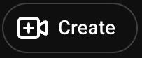

Capture the visible Create button on the local browser.

### upload_videos_item

Capture Upload videos from the open Create menu.

### select_files_button

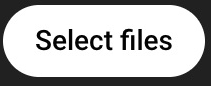

Capture Select files. Choosing a file starts a transfer; use an authorized SQL video.

### details_title_field

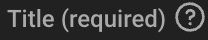

Capture the stable Title label, then measure a local click point inside its editable area. Do not capture a video title.

### details_description_field

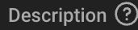

Capture the stable Description label and measure the local editable-area click point. Omit entered text.

### not_made_for_kids_radio

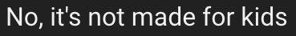

Capture this audience choice and the local radio target. Choose only when appropriate for the video.

### made_for_kids_radio

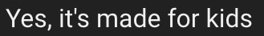

Alternative audience choice. Do not select it just because it appears in this example set.

### show_more_button

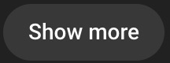

Capture Show more to reveal the tags controls.

### tags_field

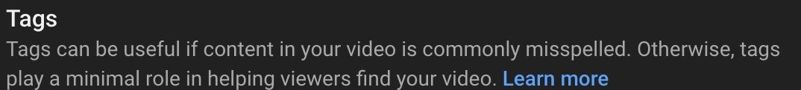

Example shows a label and help text, not the actual editable input. Locate and measure the input locally; omit entered tags.

### next_button

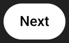

Capture enabled Next as a fallback when direct step navigation is unavailable.

### visibility_tab_button

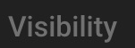

Capture the visible Visibility step tab and verify that clicking it opens that step.

### visibility_step_marker

Heading identifies the Visibility step; it is not a click target or a selected privacy state.

### private_radio

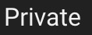

Label example only. Capture the local radio control and verify its selected state before saving.

### copy_link_button

Capture the copy-link control with enough local context to distinguish it from other copy icons. The URL is intentionally absent.

### save_button

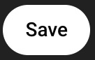

Capture the enabled Save button. Save acceptance is submitted status, not proof processing finished.

### upload_complete_marker

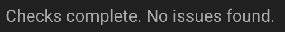

Legacy template name: this image actually reads Checks complete. No issues found. It does not prove transfer completion or a saved upload. Do not wait for checks in the default fast flow.

### finished_content_marker

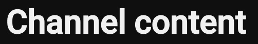

Channel content heading is a navigation marker only. It does not prove a specific video was saved; verify the matching row or confirmation and URL locally.
